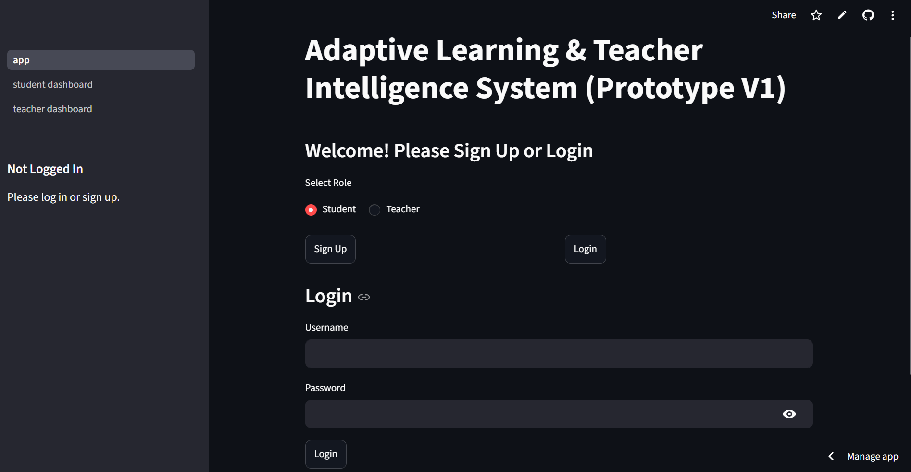
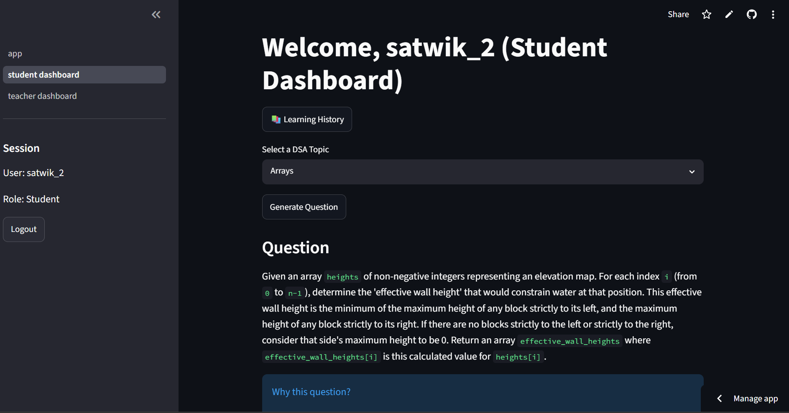
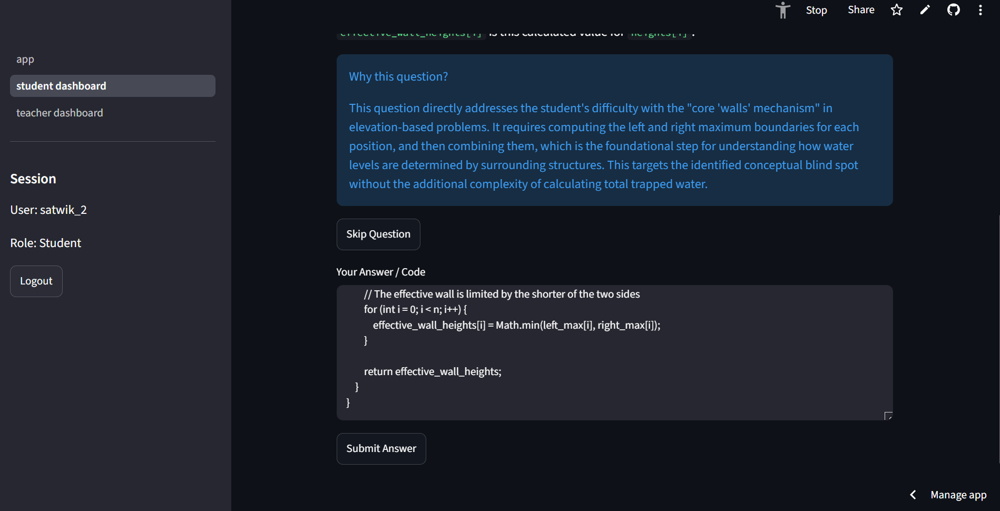
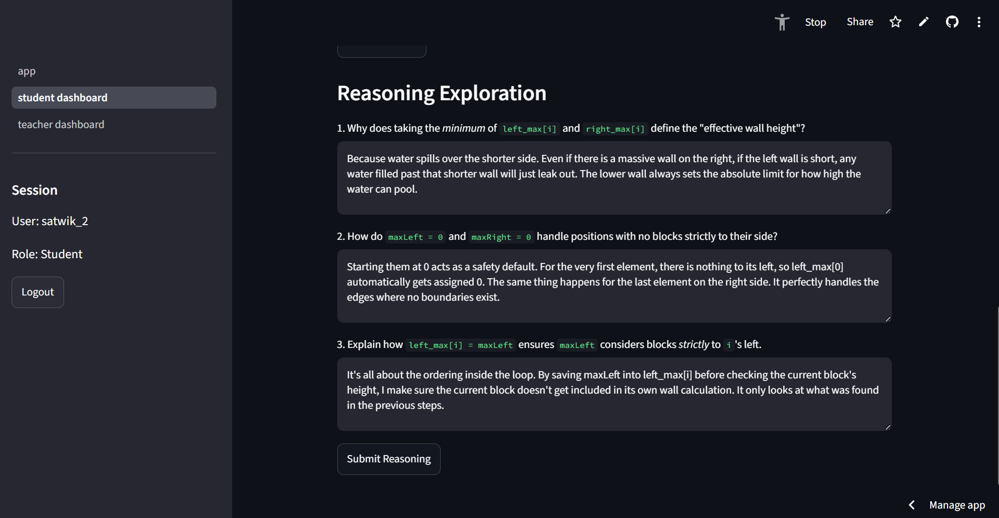
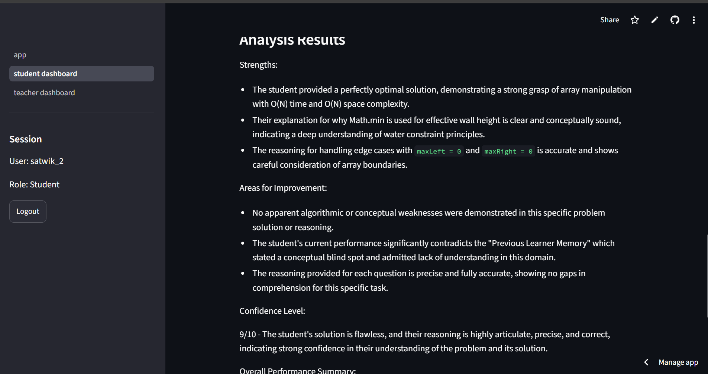
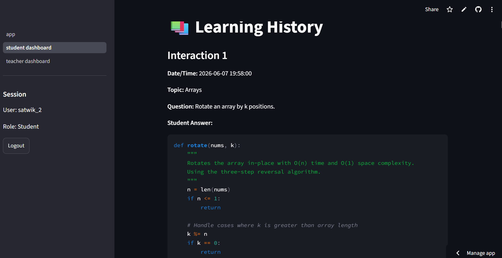
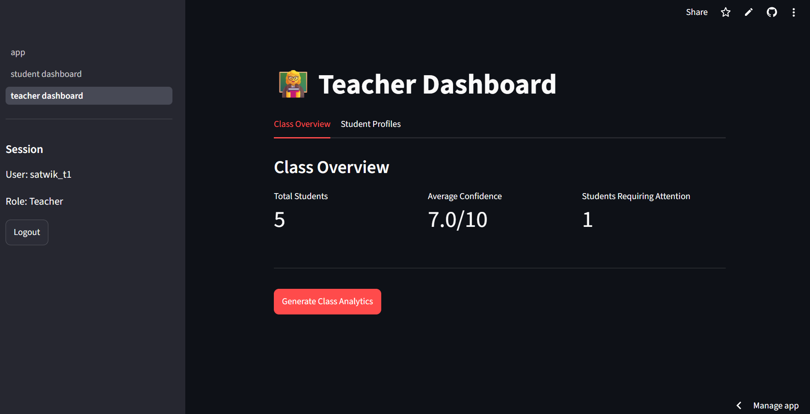
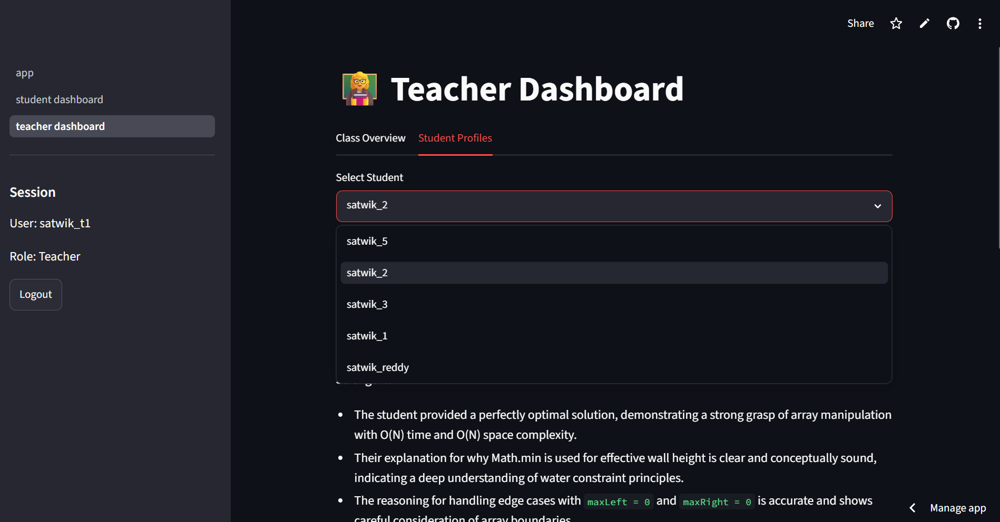
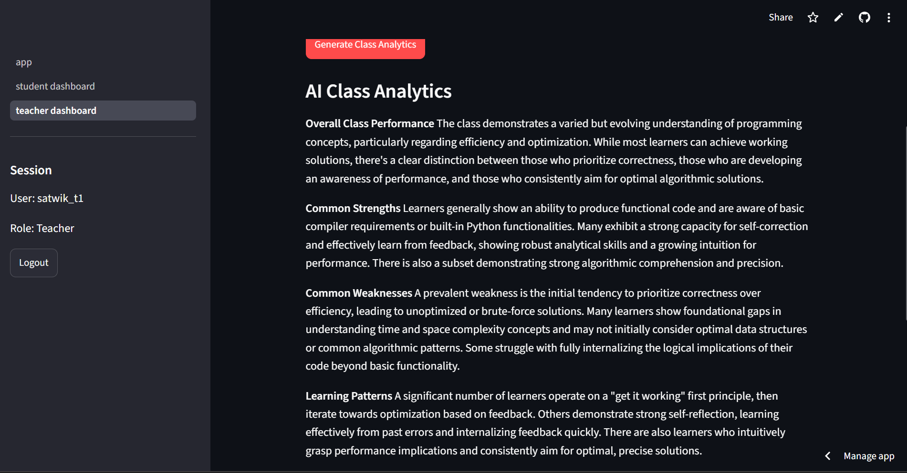

# Adaptive Learning & Teacher Intelligence System

> An AI-powered adaptive learning platform that shifts the focus from **answer evaluation** to **reasoning evaluation**, enabling personalized learning for students and meaningful insights for teachers.

---

# Project Overview

Traditional online learning platforms primarily evaluate whether a student's answer is correct or incorrect. While this measures outcomes, it often fails to understand **how the student thinks** or **why a particular mistake occurs**.

This project addresses that limitation by introducing an adaptive learning workflow where AI evaluates both the student's solution and reasoning process, builds a rolling learner memory over multiple interactions, and continuously personalizes future learning experiences.

In addition to supporting students, the platform also provides teachers with AI-generated student-level and class-level insights that can assist in identifying learning patterns and planning interventions.

---

# Problem Statement

Current learning systems generally:

* Focus only on final answers.
* Provide identical questions to every learner.
* Lack long-term understanding of student learning behaviour.
* Offer limited actionable insights to teachers.

This project attempts to address these challenges through adaptive learning powered by Generative AI.

---

# Proposed Solution

The system combines AI-driven reasoning analysis with adaptive question generation.

Instead of simply checking whether an answer is correct, the platform:

* Evaluates the submitted solution.
* Generates personalized reasoning questions.
* Analyses the student's thought process.
* Maintains a rolling learner memory.
* Uses previous learning behaviour to adapt future questions.
* Provides meaningful analytics for teachers.

---

# System Workflow

Student Workflow

1. Student logs in.
2. Selects a DSA topic.
3. AI generates an adaptive coding question.
4. Student submits code.
5. AI generates reasoning questions based on the submitted solution.
6. Student answers the reasoning questions.
7. AI evaluates:

   * Strengths
   * Areas for Improvement
   * Confidence Level
   * Overall Performance Summary
   * General Feedback
8. A hidden rolling learner memory is updated.
9. The next question is generated using the updated learner memory.
10. The system explains *Why this Question?* to improve transparency.

Teacher Workflow

* View class overview.
* View student profiles.
* Access complete learning history.
* Generate AI-powered class analytics.
* Identify common strengths and weaknesses.
* Receive teaching recommendations.

---

# Key Features

### Student Module

* Secure login and signup
* AI-generated coding questions
* Dynamic reasoning question generation
* AI-based learner analysis
* Rolling learner memory
* Adaptive next-question generation
* Learning history
* Personalized feedback

### Teacher Module

* Teacher dashboard
* Student profile viewer
* Complete learning history
* AI-powered class analytics
* Numerical class statistics
* Teaching recommendations

---

# Technology Stack

Frontend

* Streamlit

Backend

* Python

Artificial Intelligence

* Google Gemini API (REST)

Data Storage

* JSON

Version Control

* Git & GitHub

Deployment

* Streamlit Community Cloud

---

# 📂 Project Structure

```text
adaptive-learning-system/
│
├── ai/
├── config/
├── data/
├── pages/
├── assets/
│   └── screenshots/
├── app.py
├── requirements.txt
└── README.md
```

---

# Screenshots

## Landing Page



---

## Student Dashboard



---

## Code Submission



---

## Dynamic Reasoning Questions



---

## AI Learner Analysis



---

## Learning History



---

## Teacher Dashboard



---

## Student Profile



---

## AI Class Analytics



---

# Running the Project

1. Clone the repository.
2. Install dependencies.

```bash
pip install -r requirements.txt
```

3. Create a `.env` file.

```env
GEMINI_API_KEY=YOUR_API_KEY
```

4. Start the application.

```bash
streamlit run app.py
```

---

# Live Demo

**Live Application**

(Add your Streamlit Cloud URL here)

---

# Future Enhancements

* Replace JSON storage with a persistent database (SQLite, PostgreSQL, Firebase, or Supabase).
* Topic-wise learner tracking.
* Scalable teacher analytics through aggregated learner representations.
* Enhanced authentication and role management.
* Advanced visual analytics and dashboards.

---

# What I Learned

This project provided practical experience in:

* Prompt Engineering
* REST API Integration
* Streamlit Application Development
* Adaptive Learning System Design
* AI-powered Educational Workflows
* Git & GitHub
* Cloud Deployment
* CI/CD using GitHub and Streamlit Community Cloud
* Environment Variable & Secret Management
* Debugging cloud deployments
* Designing software with future scalability in mind

---

# 👨‍💻 Author

**Satwik Reddy Pathapati**

If you found this project interesting, feel free to explore the repository, try the live demo, or connect with me for feedback and discussions.
